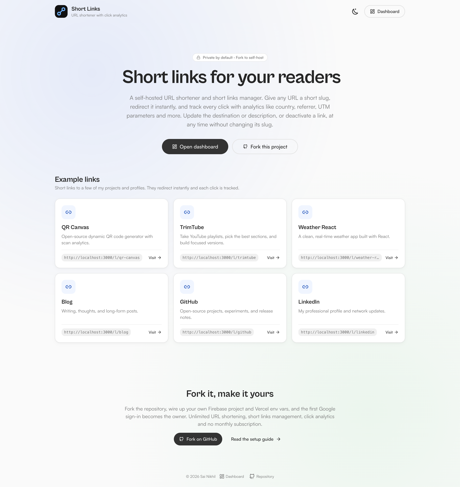
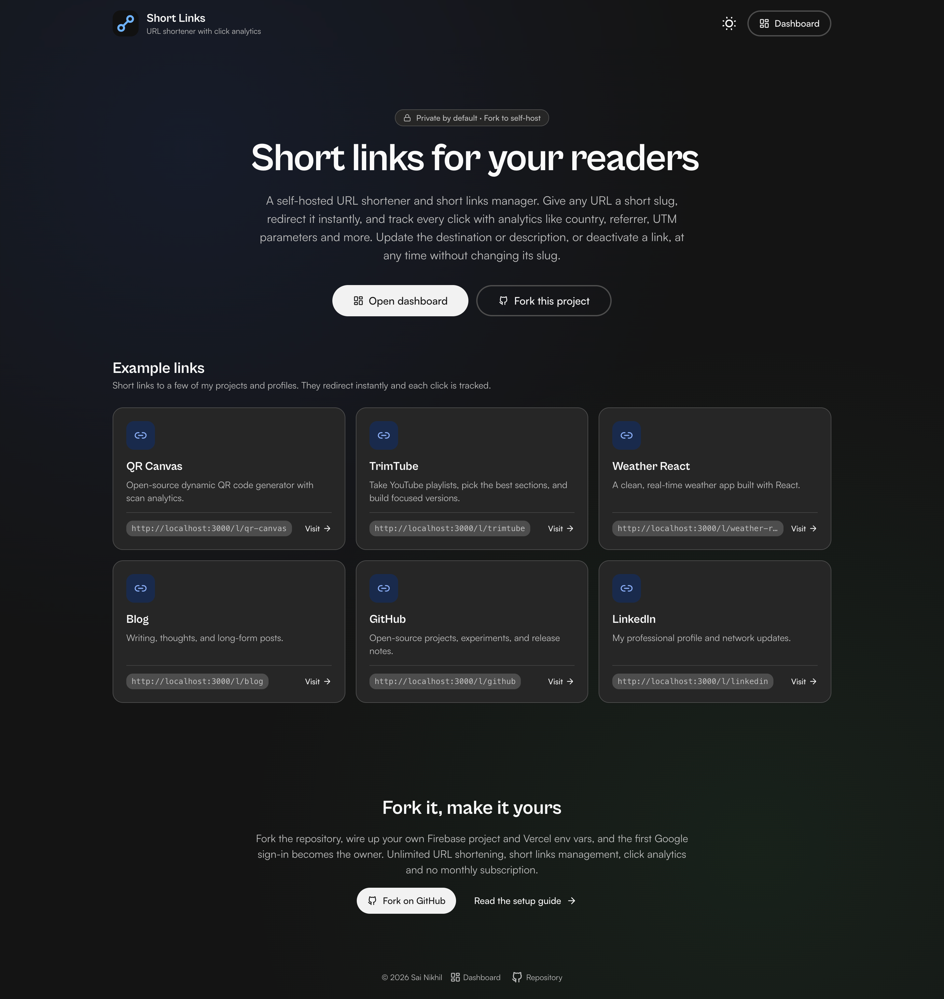
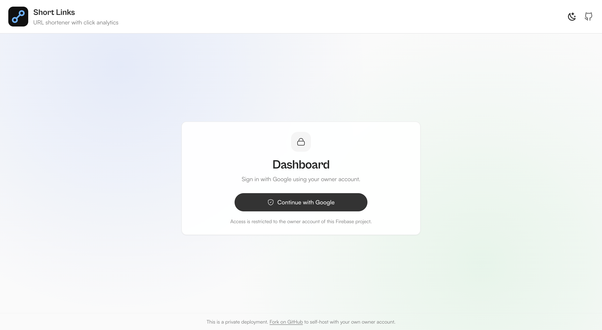
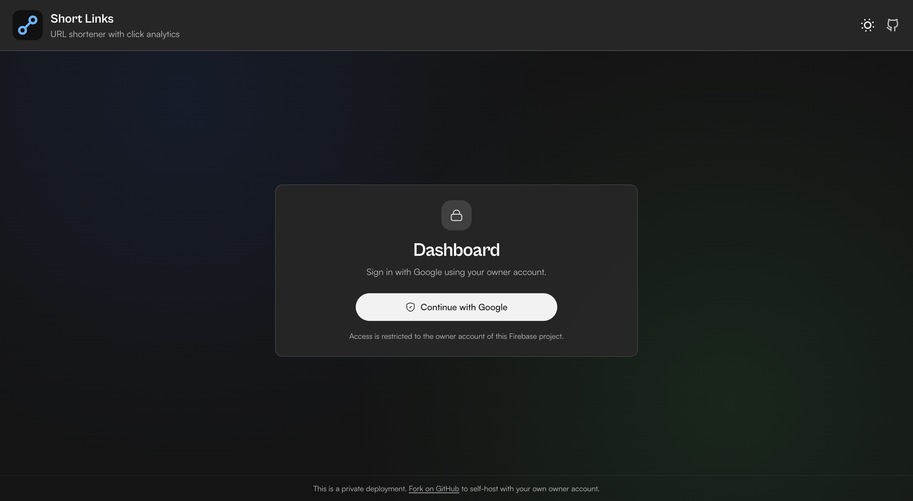
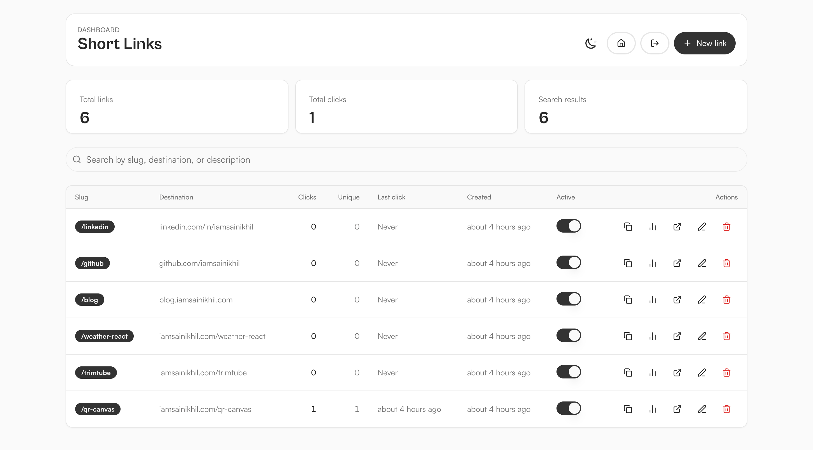
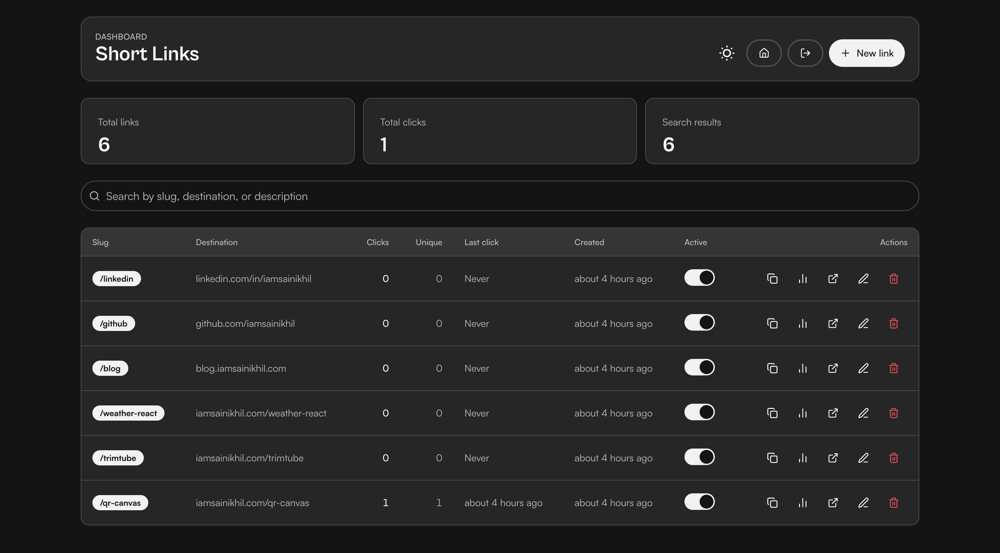
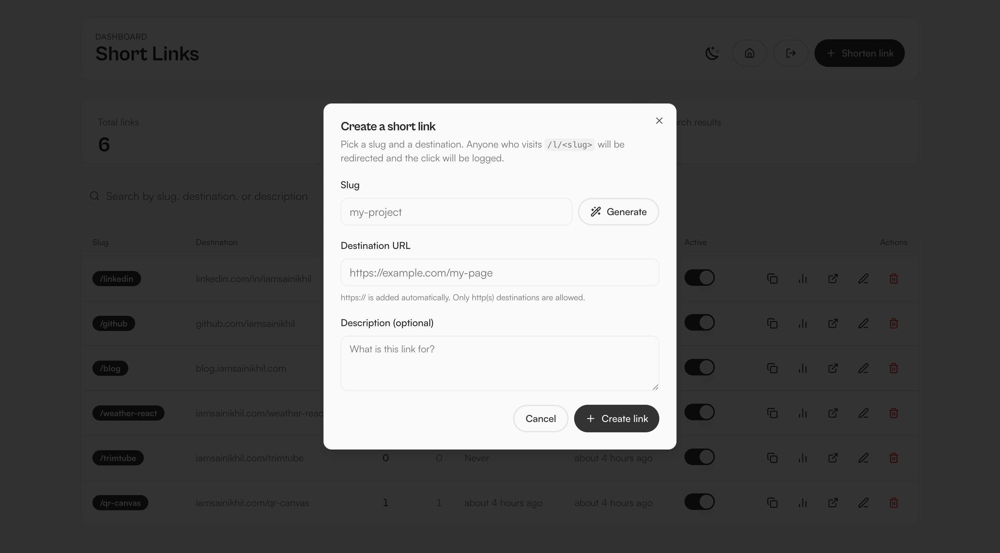
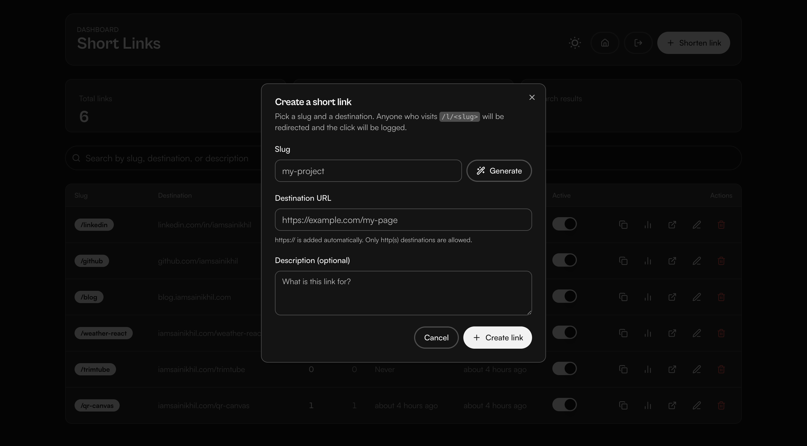

<p align="center">
  
</p>

<h1 align="center">Short Links</h1>

<p align="center">
  <strong>A self-hosted URL shortener and short links manager. Give any URL a short slug, redirect it instantly, and track every click with analytics like country, referrer, UTM parameters and more. Update the destination or description, or deactivate a link, at any time without changing its slug.</strong>
</p>

<p align="center">
  <a href="LICENSE"></a>
  
</p>

Create short links like
`https://iamsainikhil.com/l/slug` that 302-redirect to any URL, then inspect per-link
analytics: click count, unique visitors, country/region/city, referrer, UTM parameters, and a
time-series chart. Change a link's destination or description — or deactivate it entirely —
at any time without changing its slug.

A short-links-style fork of [qr-canvas](https://github.com/iamsainikhil/qr-canvas) that reuses the
same architecture: Next.js App Router, Firebase Auth/Firestore, the Admin SDK for redirect-time
writes, and hand-rolled SVG charts.

- The **public landing page** (`/`) shows a few example links read from a config file.
- The **`/l/<slug>` redirect** is public (anyone clicks those links).
- The **dashboard** is private: only the first Google sign-in becomes the owner.

Fork it, point it at your own Firebase project, and you get your own fully private instance.

## Features

- **Short links** — `https://<your-domain>/l/<slug>` 302-redirects to any `http(s)` destination with `Cache-Control: no-store` (edits apply instantly, no caching).
- **Click analytics** — total clicks, unique visitors (courtesy of a lazy 1-year `visitor_id` cookie), 7d/30d SVG bar chart, top countries/regions, referrers, UTM breakdown, and a raw event table you can export to CSV.
- **Bot filtering** — crawlers and social previewers are redirected without inflating click counts.
- **Self-referential / protocol guard** — `javascript:`/`data:`/`file:` and loops back to `/l/` are blocked.
- **Slug validation** — `[a-z0-9-]`, 3–50 chars, reserved words and single characters rejected, uniqueness checked against Firestore.
- **Rename with forwarding** — renaming a slug writes the new doc and leaves a `movedTo` marker so the old URL keeps working.
- **Single-owner private mode** — the first Google sign-in locks the deployment; any other account is denied.

## Demo

### Home

| Light | Dark |
|-------|------|
|  |  |

### Dashboard

| Light | Dark |
|-------|------|
|  |  |

### User dashboard

| Light | Dark |
|-------|------|
|  |  |

### Shorten link dialog

| Light | Dark |
|-------|------|
|  |  |

## Quick Start

```bash
git clone git@github.com:iamsainikhil/short-links.git
cd short-links
npm install
npm run dev
```

Open http://localhost:3000. The landing page works immediately; the dashboard renders a
"Firebase not configured" state until you complete the setup below.

## One-Page Setup (Firebase + Vercel)

1. **Create a Firebase project** at [console.firebase.google.com](https://console.firebase.google.com).
   Enable **Authentication → Sign-in method → Google**, and **Firestore** (production mode).
2. **Add authorized domains** — Authentication → Settings → Authorized domains:
   - `iamsainikhil.com` and any `*.vercel.app` domains, plus `localhost` (already present by default).
3. **Deploy the security rules** (single-owner, no public reads):
   ```bash
   npx firebase use --add           # select your project
   npm run lint && firebase deploy --only firestore:rules
   ```
   or paste `firestore.rules` directly in the Firebase Console.
4. **Create a service account key** — Project settings → Service accounts → Generate new private key.
5. **Set Vercel environment variables** (see [Environment Variables](#environment-variables)):
   all `FIREBASE_*` (Admin), all `NEXT_PUBLIC_FIREBASE_*` (client), `NEXT_PUBLIC_PRIVATE_MODE=true`,
   `NEXT_PUBLIC_SITE_URL=https://iamsainikhil.com`, and a random `SCAN_IP_HASH_SALT`.
6. **Connect your custom domain** (`iamsainikhil.com`) to the Vercel project so both `/` and `/l/*`
   hit the app. Keep `NEXT_PUBLIC_PRIVATE_MODE=true` on.
7. **Visit `/dashboard` and sign in with Google.** The first account becomes the owner (`app_config/private`).
   A different account is denied.
8. **(Optional) seed the demo links** so the example cards on `/` actually redirect:
   ```bash
   npm run seed-demo
   ```
   It upserts the `links/{slug}` docs from `src/config/exampleLinks.ts`. You can also set
   `FIREBASE_OWNER_UID` to skip the sign-in check.

> Vercel Password Protection is optional extra security; the owner gate already restricts the dashboard.

## Environment Variables

| Variable | Required | Description |
|----------|----------|-------------|
| `NEXT_PUBLIC_SITE_URL` | Yes (prod) | Public origin used to build `/l/...` URLs, e.g. `https://iamsainikhil.com`. |
| `NEXT_PUBLIC_PRIVATE_MODE` | Yes | `true` locks everything except landing + redirects behind the owner sign-in. |
| `NEXT_PUBLIC_BASE_PATH` | No | Subpath deployments, e.g. `/short-links`. Defaults to `""` (root). |
| `NEXT_PUBLIC_FIREBASE_API_KEY` | Yes | Firebase client API key. |
| `NEXT_PUBLIC_FIREBASE_AUTH_DOMAIN` | Yes | Firebase auth domain. |
| `NEXT_PUBLIC_FIREBASE_PROJECT_ID` | Yes | Firebase project ID. |
| `NEXT_PUBLIC_FIREBASE_STORAGE_BUCKET` | No | Firebase storage bucket (unused today, kept for parity). |
| `NEXT_PUBLIC_FIREBASE_MESSAGING_SENDER_ID` | Yes | Firebase sender ID. |
| `NEXT_PUBLIC_FIREBASE_APP_ID` | Yes | Firebase app ID. |
| `FIREBASE_PROJECT_ID` | Yes | Admin SDK project ID. |
| `FIREBASE_CLIENT_EMAIL` | Yes | Admin SDK service-account client email. |
| `FIREBASE_PRIVATE_KEY` | Yes | Admin SDK private key (escape newlines as `\n`). |
| `SCAN_IP_HASH_SALT` | Yes | Salt for IP-range hashing in click analytics. Generate a strong random secret, e.g. `openssl rand -base64 32`. |
| `FIREBASE_OWNER_UID` | No | Optional owner UID used by `npm run seed-demo`. |

See `.env.example` for a copy-paste template with descriptions.

## Security rules

`firestore.rules` mirrors the license model:

- `app_config/private` — bootstrap owner doc: create only if none exists and `ownerUid == request.auth.uid`.
- `links/{slug}` — read/create/update/delete only the owner (client writes as owner).
- `links/{slug}/clicks/{clickId}` — read/delete by owner; **create/update denied** for clients.
  Click events are written only by the server-side Admin SDK in `/l/[slug]/route.ts`, which per se
  bypasses rules — so the public redirect path is a plain single-doc read.
- catch-all `if false` — everything else is denied.

## How a redirect works

1. A visitor hits `/l/slug` (route handler, `dynamic = 'force-dynamic'`, Node runtime).
2. The handler fetches the `links/{slug}` doc with the Admin SDK (single fetch).
   - Missing → `302 /link-error?reason=not_found`; inactive → `disabled`; `movedTo` → forwards to the new slug; malformed/insecure destination → `invalid`.
3. `normalizeUrl` enforces `http(s)`, blocks `javascript:`/`data:`/`file:`, and rejects destinations
   that route back through this app's `/l/` (loop guard).
4. Bot user-agents get a plain `302` (no click). Real clicks get a `302` with `Cache-Control: no-store`,
   a lazy-set `visitor_id` cookie (1 year, httpOnly), and the click is written by the Admin SDK:
   timestamp, visitor ID, hashed IP prefix, referrer, Vercel geo headers, and UTM query params.
5. `links/{slug}.stats.clickCount` increments on every click; `uniqueVisitors` increments only for
   browsers whose `visitor_id` hasn't clicked this link before.

## Project Structure

```
app/
  layout.tsx                Root layout + Toaster + RuntimeRecovery
  page.tsx                  Public landing page (server component → Landing view)
  link-error/page.tsx       Redirect error page (reason mapping)
  redirect-error/page.tsx   Alias of link-error
  l/[slug]/route.ts         THE redirect handler (single helper, Admin SDK writes)
  dashboard/page.tsx        Owner-gated dashboard
  not-found.tsx / error.tsx / global-error.tsx
src/
  views/Landing.tsx         Public landing + example links + fork CTA
  views/LinksDashboard.tsx  Link manager, create/edit/rename/toggle/delete, analytics drawer, CSV
  views/Error.tsx           Error page with Lottie
  components/PrivateAppGate.tsx  Owner-only Google sign-in gate
  components/ClickChart.tsx      Hand-rolled SVG bar chart
  lib/links.ts              Types, slug validator, reserved words, URL normalization, loop guard
  lib/firestoreLinks.ts     Client CRUD (mirrors firestoreQrCodes)
  lib/firebaseAdmin.ts      Memoized Admin SDK singleton
  lib/privateOwner.ts       app_config/private owner check
  config/exampleLinks.ts    Hardcoded example links (landing + seed script)
firestore.rules             Single-owner Firestore rules
scripts/seed-demo.ts        Admin SDK upsert of the example links
```

## NPM scripts

| Script | Description |
|--------|-------------|
| `npm run dev` | Local Next.js dev server |
| `npm run build` | Production build |
| `npm run start` | Start the production server |
| `npm run lint` | Run ESLint |
| `npm run seed-demo` | Upsert example `links/*` docs via the Admin SDK |

## Data model

```
links/{slug}                       # one doc per short link (single-fetch redirect)
  slug, ownerUid, url, displayUrl, description,
  active, createdAt, updatedAt,
  stats: { clickCount, uniqueVisitors, lastClickAt },
  movedTo?                         # set when renamed

links/{slug}/clicks/{clickId}      # clicked events — Admin SDK only writes
  timestamp, visitorId, ipHash, userAgent, referrer,
  country, region, city,
  utm_source, utm_medium, utm_campaign, utm_term, utm_content

app_config/private                 # owner bootstraps (first Google sign-in)
  ownerUid, createdAt, updatedAt

```

## Troubleshooting

| Problem | Solution |
|---------|----------|
| Redirect shows `link-error` | Check the slug exists, is `active`, and its destination is `http(s)` (not `javascript:`/`data:`/loop). |
| Auth redirect loop | Add your domain (and Vercel domain) to Firebase → Auth → Authorized domains. |
| `Permission denied` | Deploy `firestore.rules` and verify `NEXT_PUBLIC_FIREBASE_PROJECT_ID`. |
| Redirect fails in prod | Verify `FIREBASE_PRIVATE_KEY` newlines were preserved (base64/multi-line) and `SCAN_IP_HASH_SALT` is set. |
| Unique visitors look low | The `visitor_id` cookie is set per-browser; clearing cookies or using incognito resets it. |
| Example links don't redirect | Run the seed-demo script once (owner from `app_config/private`). |

## Privacy note

The public landing page never loads Firebase client data it doesn't strictly need like example links
come from a static config file. Only the owner's dashboard reads Firestore. Visit paths are read
server-side.